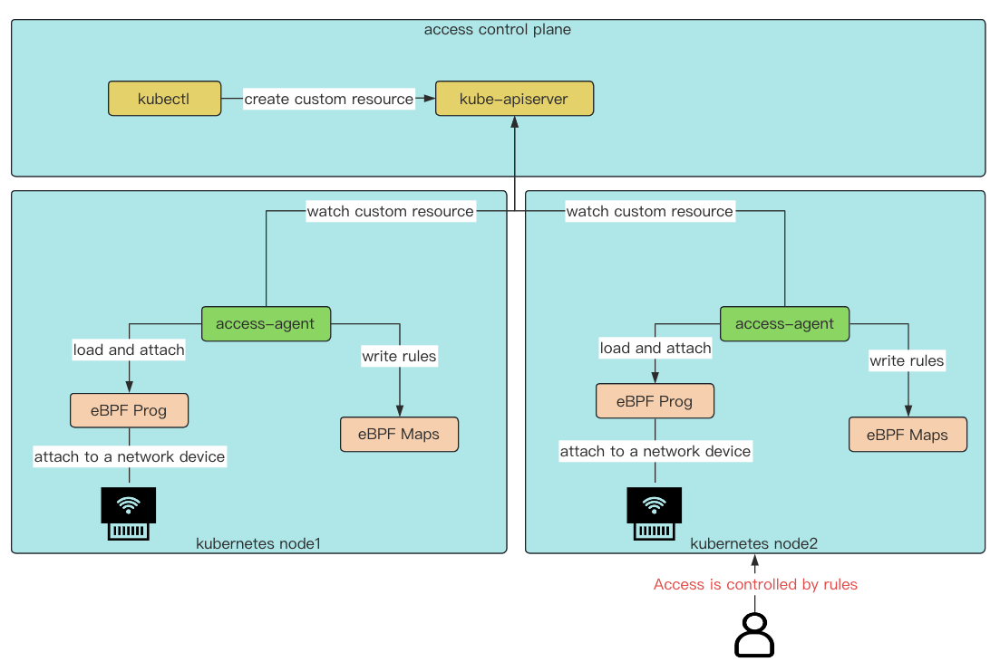

# Access control

Access control is a node access controller running on kubernetes

## Architecture

## Quick Start

// todo

## Feature

+ IP whitelist access control

## What's Next

More will be coming Soon. Welcome to [open an issue](https://github.com/Fish-pro/access/issues) and [propose a PR](https://github.com/Fish-pro/access/pulls). 🎉🎉🎉

## Contributors

Made with [contrib.rocks](https://contrib.rocks).
