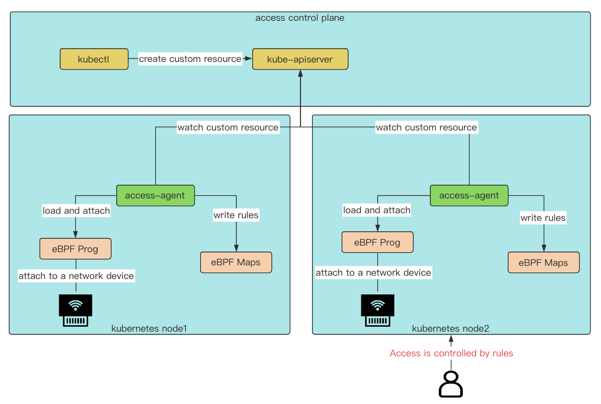

# Access control

Access control is a node access controller running on kubernetes, Access currently implements the ability to customize the IP blacklist of resource management nodes. If the NIC driver supports it, the access package can be dropped directly from the NIC. Of course, it will run in the XDP generic mode if there is no specific network card supported, but it is important to note that Access currently supports only a specific individual network card. See [Quick Start](https://github.com/Fish-pro/access) for details

## Architecture



## Quick Start

The example is quickly demonstrated locally using [kind](https://github.com/kubernetes-sigs/kind), so install kind before testing

### clone project
```bash
➜  ~ git clone https://github.com/Fish-pro/access.git
正克隆到 'access'...
remote: Enumerating objects: 7456, done.
remote: Counting objects: 100% (865/865), done.
remote: Compressing objects: 100% (447/447), done.
remote: Total 7456 (delta 266), reused 851 (delta 256), pack-reused 6591
接收对象中: 100% (7456/7456), 9.67 MiB | 251.00 KiB/s, 完成.
处理 delta 中: 100% (2352/2352), 完成.
正在更新文件: 100% (4085/4085), 完成.
➜  ~ cd access/charts
```

### create cluster

```bash
➜  charts git:(master) kind create cluster --name ik8s --config demo/kind.yaml
Creating cluster "ik8s" ...
 ✓ Ensuring node image (kindest/node:v1.21.1) 🖼
 ✓ Preparing nodes 📦 📦 📦
 ✓ Writing configuration 📜
 ✓ Starting control-plane 🕹️
 ✓ Installing CNI 🔌
 ✓ Installing StorageClass 💾
 ✓ Joining worker nodes 🚜
Set kubectl context to "kind-ik8s"
You can now use your cluster with:

kubectl cluster-info --context kind-ik8s

Thanks for using kind! 😊
➜  charts git:(master) ✗ kubectl get no -o wide
NAME                 STATUS   ROLES                  AGE   VERSION   INTERNAL-IP   EXTERNAL-IP   OS-IMAGE       KERNEL-VERSION     CONTAINER-RUNTIME
ik8s-control-plane   Ready    control-plane,master   10m   v1.21.1   172.19.0.4    <none>        Ubuntu 21.04   5.15.49-linuxkit   containerd://1.5.2
ik8s-worker          Ready    <none>                 10m   v1.21.1   172.19.0.2    <none>        Ubuntu 21.04   5.15.49-linuxkit   containerd://1.5.2
ik8s-worker2         Ready    <none>                 10m   v1.21.1   172.19.0.3    <none>        Ubuntu 21.04   5.15.49-linuxkit   containerd://1.5.2
```

### load images

load the image into the hold. If the image does not exist locally, `docker pull` can be used

```bash
➜  charts git:(master) kind load docker-image fishpro3/access:v1.0 nginx:stable --name ik8s
Image: "fishpro3/access:v1.0" with ID "sha256:37f6caebb40e8224fc25e68bc4765298061d19d080487cf9d7389be7289fa69d" not yet present on node "ik8s-control-plane", loading...
Image: "fishpro3/access:v1.0" with ID "sha256:37f6caebb40e8224fc25e68bc4765298061d19d080487cf9d7389be7289fa69d" not yet present on node "ik8s-worker", loading...
Image: "fishpro3/access:v1.0" with ID "sha256:37f6caebb40e8224fc25e68bc4765298061d19d080487cf9d7389be7289fa69d" not yet present on node "ik8s-worker2", loading...
Image: "nginx:stable" with ID "sha256:8c9eabeac475449c72ad457ccbc014788a02dbbc64f24158b0a40fdc5def2dc9" not yet present on node "ik8s-control-plane", loading...
Image: "nginx:stable" with ID "sha256:8c9eabeac475449c72ad457ccbc014788a02dbbc64f24158b0a40fdc5def2dc9" not yet present on node "ik8s-worker", loading...
Image: "nginx:stable" with ID "sha256:8c9eabeac475449c72ad457ccbc014788a02dbbc64f24158b0a40fdc5def2dc9" not yet present on node "ik8s-worker2", loading...
```

### create nginx application

Create an nginx application and expose the service using `NodePort`

```bash
➜  charts git:(master) ✗ kubectl create -f demo/nginx.yaml
pod/nginx created
service/nginx-service created
```

Log in to ik8s-worker2 and access services exposed on ik8s-worker1 NodePort. The services are successfully accessed

```bash
➜  charts git:(master) ✗ docker exec -it ik8s-worker2 /bin/bash
root@ik8s-worker2:/# curl 172.19.0.2:30100
<!DOCTYPE html>
<html>
<head>
<title>Welcome to nginx!</title>
<style>
html { color-scheme: light dark; }
body { width: 35em; margin: 0 auto;
font-family: Tahoma, Verdana, Arial, sans-serif; }
</style>
</head>
<body>
<h1>Welcome to nginx!</h1>
<p>If you see this page, the nginx web server is successfully installed and
working. Further configuration is required.</p>

<p>For online documentation and support please refer to
<a href="http://nginx.org/">nginx.org</a>.<br/>
Commercial support is available at
<a href="http://nginx.com/">nginx.com</a>.</p>

<p><em>Thank you for using nginx.</em></p>
</body>
</html>
```


### install Access

```bash
➜  charts git:(master) ✗ kubectl create ns access-system
namespace/access-system created
➜  charts git:(master) ✗ kubectl create -f access/_crds/bases/sample.access.io_accesses.yaml
customresourcedefinition.apiextensions.k8s.io/accesses.sample.access.io created
➜  charts git:(master) ✗ kubectl -n access-system create -f demo/all-in-one.yaml
serviceaccount/access created
clusterrolebinding.rbac.authorization.k8s.io/access created
daemonset.apps/access created
➜  charts git:(master) ✗ k -n access-system get po
NAME           READY   STATUS    RESTARTS   AGE
access-8xxkn   1/1     Running   0          4m32s
access-lpqm9   1/1     Running   0          4m32s
```

### apply access control rule

An delivery control policy is applied to deny IP 172.19.0.3(ik8s-worker2) access to the ik8s-worker node

```bash
➜  charts git:(master) ✗ cat << EOF | kubectl create -f -
apiVersion: sample.access.io/v1alpha1
kind: Access
metadata:
  name: demo
spec:
  nodeName: "ik8s-worker"
  ips:
    - "172.19.0.3"
EOF
access.sample.access.io/demo created
```

After the rule application is created, you can view the rule application status

```bash
➜  charts git:(master) ✗ kubectl get access demo -o yaml
apiVersion: sample.access.io/v1alpha1
kind: Access
metadata:
  creationTimestamp: "2023-03-23T08:00:13Z"
  generation: 1
  name: demo
  resourceVersion: "2400"
  uid: a42822d5-13cd-48c4-8c02-3fb4c7e684a9
spec:
  ips:
  - 172.19.0.3
  nodeName: ik8s-worker
status:
  nodeStatuses:
    ik8s-worker:
    - 172.19.0.3
```

### validation rule

Login test whether the rule is successfully applied

```bash
➜  charts git:(master) ✗ docker exec -it ik8s-worker2 /bin/bash
root@ik8s-worker2:/# curl 172.19.0.2:30100
curl: (28) Failed to connect to 172.19.0.2 port 30100: Connection timed out
```

You can find that the access times out, so the policy is successfully applied

## Ability

+ Blacklist the IP addresses of native resource management nodes using kubernetes

## What's Next

More will be coming Soon. Welcome to [open an issue](https://github.com/Fish-pro/access/issues) and [propose a PR](https://github.com/Fish-pro/access/pulls). 🎉🎉🎉

## Contributors

<a href="https://github.com/Fish-pro/access/graphs/contributors">
  
</a>

Made with [contrib.rocks](https://contrib.rocks).

## License

Access is under the Apache 2.0 license. See the [LICENSE](LICENSE) file for details.